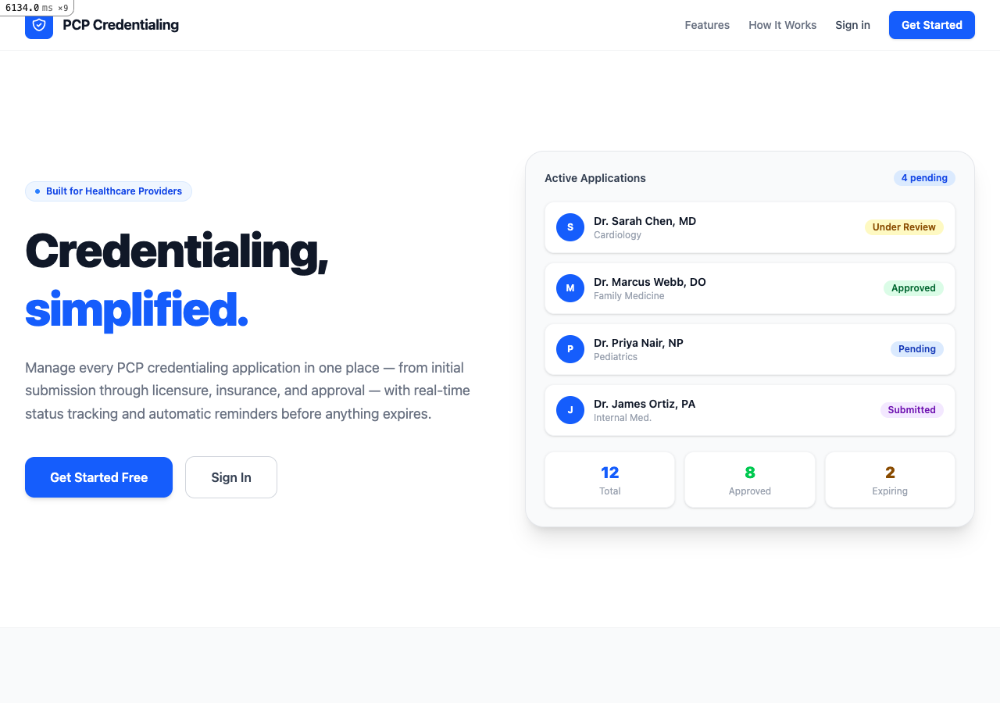
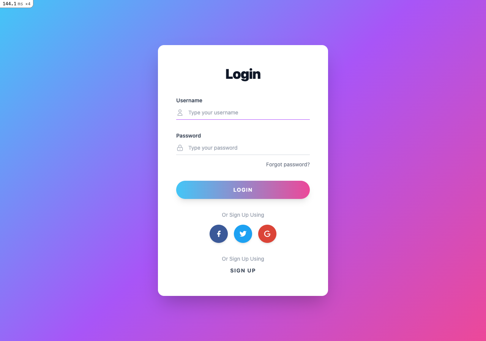
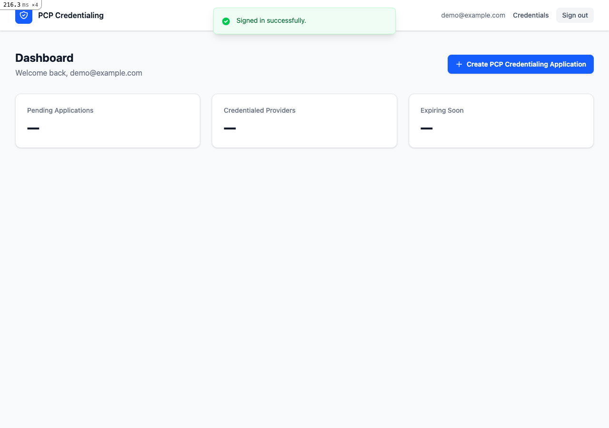
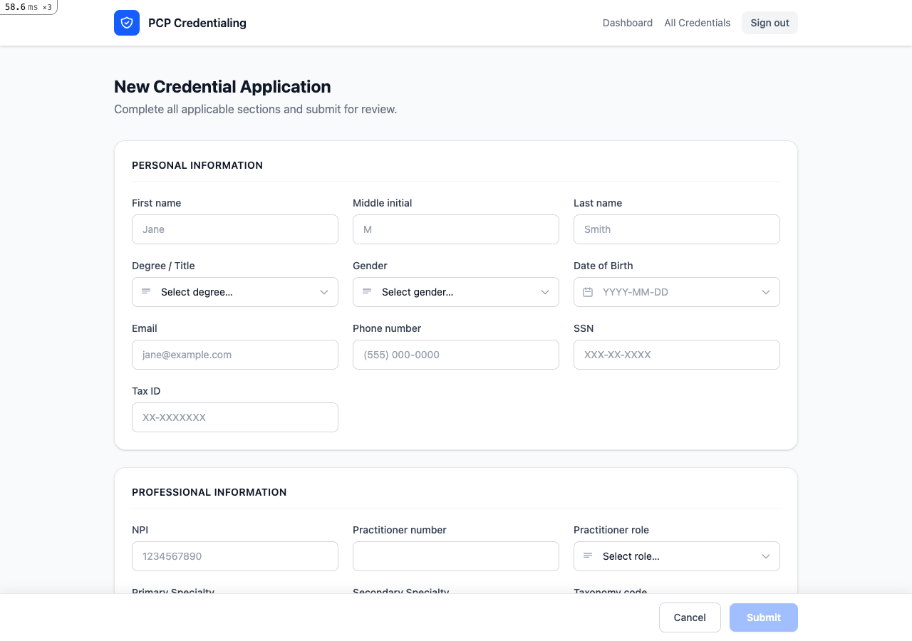

# PCP Credentialing

A full-featured web application for managing Primary Care Provider (PCP) credentialing applications. Built with Ruby on Rails 7, Devise authentication, and Tailwind CSS.

---

## What It Does

PCP Credentialing is a purpose-built platform that streamlines the end-to-end credentialing lifecycle for healthcare organizations. Instead of juggling spreadsheets, email attachments, and paper forms, credentialing staff can manage every provider application in one place — from initial submission through licensure verification, malpractice insurance tracking, and final approval.

### Core Capabilities

- **Structured credentialing applications** — Each provider application captures personal information, professional details, licensure, DEA registration, board certifications, malpractice insurance, PCP group affiliation, work history, and supporting documents in a single structured record.
- **Work history tracking** — Add and manage a provider's employment history with employer, position, and date ranges via an inline modal, all stored as relational records.
- **Expiration monitoring** — Track expiration dates for medical licenses, DEA registrations, and malpractice insurance policies. Scopes surface expiring-soon records at a glance.
- **Status management** — Applications move through a clear lifecycle: Pending → Submitted → Under Review → Approved / Denied / Expired.
- **Auto-save drafts** — The edit form debounces keystrokes and silently PATCHes the server every 900 ms so no progress is ever lost.
- **Document references** — Attach references to CVs, certifications, and supplementary documents directly to the application record.
- **Secure authentication** — User accounts are managed by Devise with encrypted passwords, session management, and password reset flows.

---

## Screenshots

### Landing Page


### Sign In


### Dashboard


### Credential Application Form


---

## Tech Stack

| Layer | Technology |
|---|---|
| Framework | Ruby on Rails 7.1 |
| Language | Ruby 3.4 |
| Authentication | Devise |
| Styling | Tailwind CSS v4 |
| Database | SQLite (development) |
| Date pickers | Flatpickr |
| Server | Puma |

---

## Getting Started

### Prerequisites

- Ruby 3.4+
- Node.js (for Tailwind CSS builds)
- Bundler

### Setup

```bash
git clone <repo-url>
cd pcp-credentialing-app

bundle install
bin/rails db:create db:migrate
```

### Running the App

```bash
# Start the Rails server
bin/rails server -p 3001

# Or use bin/dev to also watch and rebuild Tailwind CSS on changes
PORT=3001 bin/dev
```

Visit `http://localhost:3001` in your browser.

---

## Data Model

```
User
 └── (authenticates via Devise)

PcpCredential
 ├── belongs_to :pcp (User, optional)
 ├── belongs_to :pcp_group (optional)
 ├── has_many :work_histories
 └── Fields: personal info, NPI, licensure, DEA, board certs,
             malpractice insurance, PCP group, documents, status

WorkHistory
 ├── belongs_to :pcp_credential
 └── Fields: employer, position, work_start, work_end
```

---

## Key Enums

| Field | Values |
|---|---|
| `status` | pending, submitted, under_review, approved, denied, expired |
| `title_degree` | MD, DO, NP, PA, PhD, DPM, DDS, DMD, OD, other |
| `practitioner_role` | primary_care, specialist, hospitalist, surgeon, anesthesiologist, radiologist, psychiatrist, other |
| `speciality` | family_medicine, internal_medicine, pediatrics, cardiology, dermatology, and 17 more |
| `gender` | male, female, non_binary, undisclosed |
